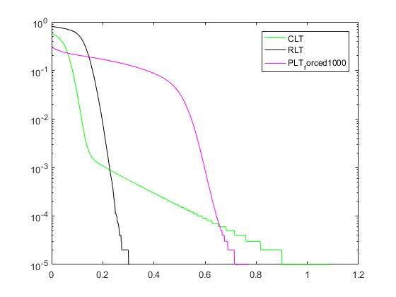

# LT-code-improvements

+ CLT is LT code with random encoding. RLT is regular LT code. PLT is my proposed code. 

+ We switch to RLT when overhead is zero. It is apparently late.

+ We switch to RLT when overhead equals to -0.9. It improves the performance when it compares to RLT.

